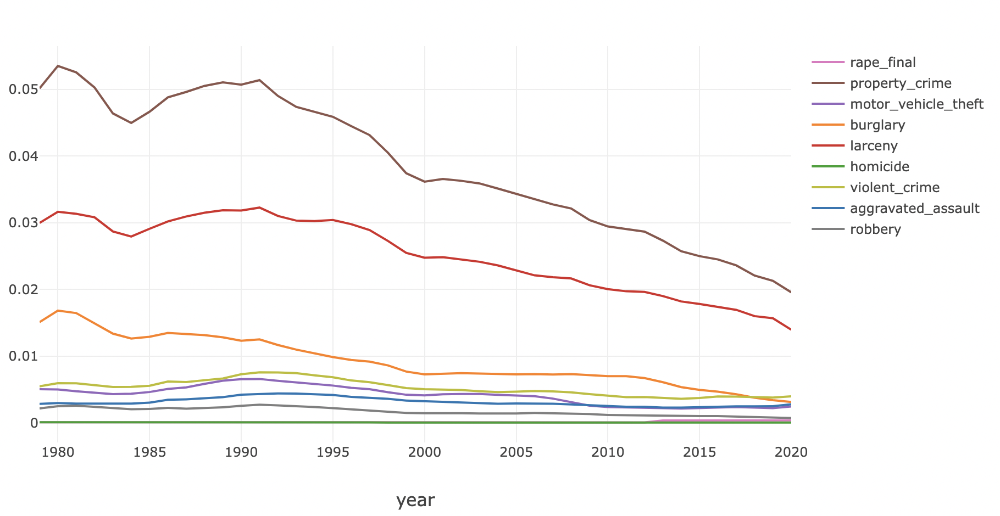
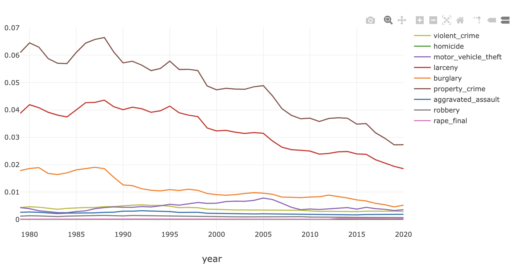
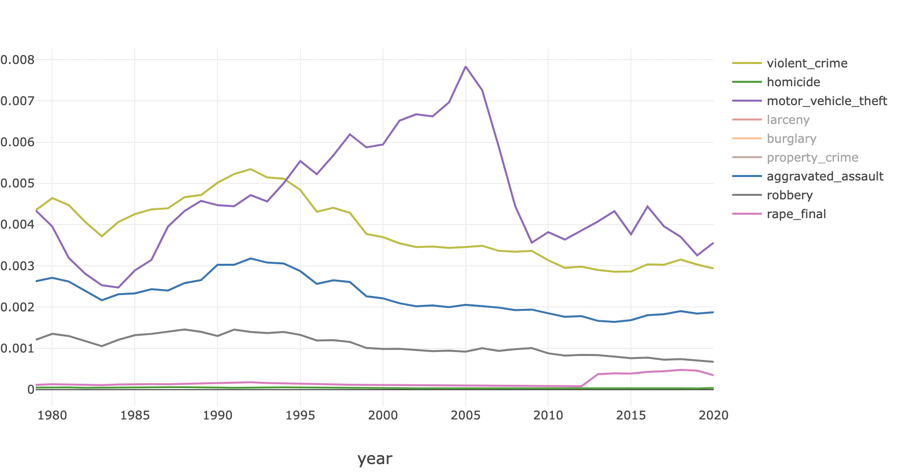
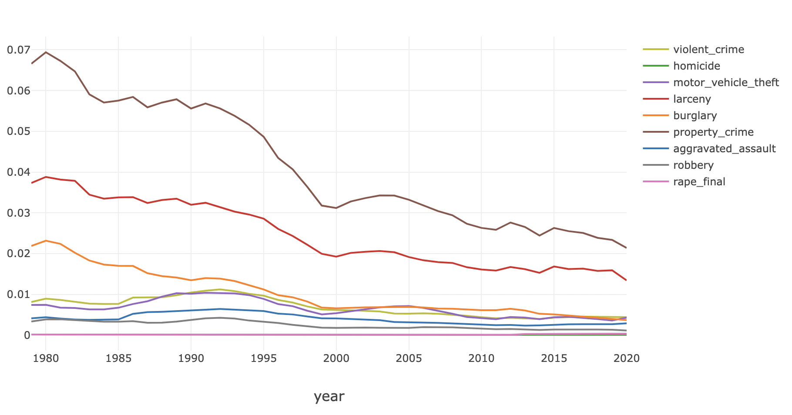
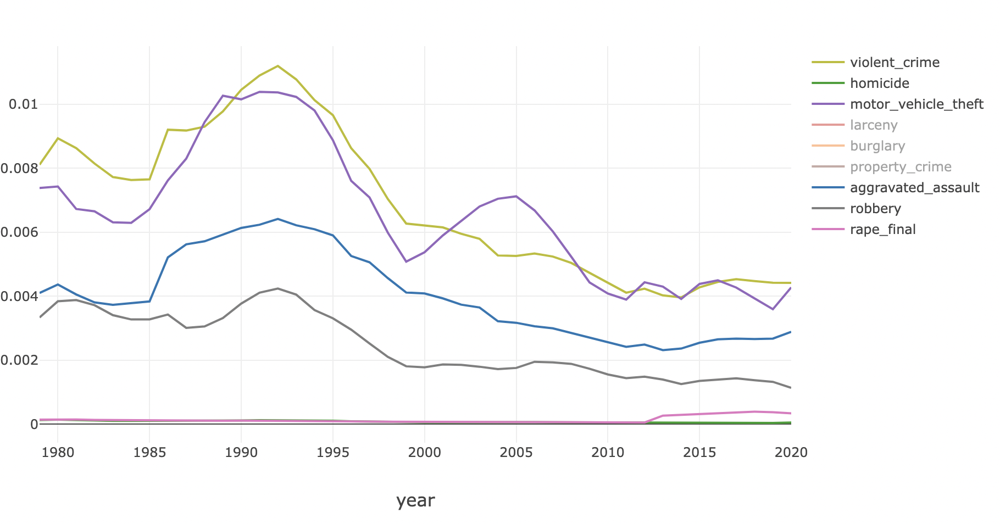
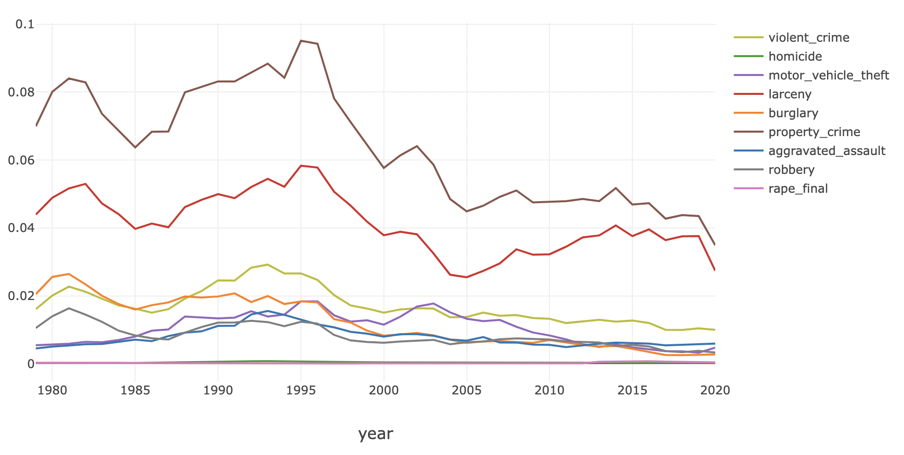
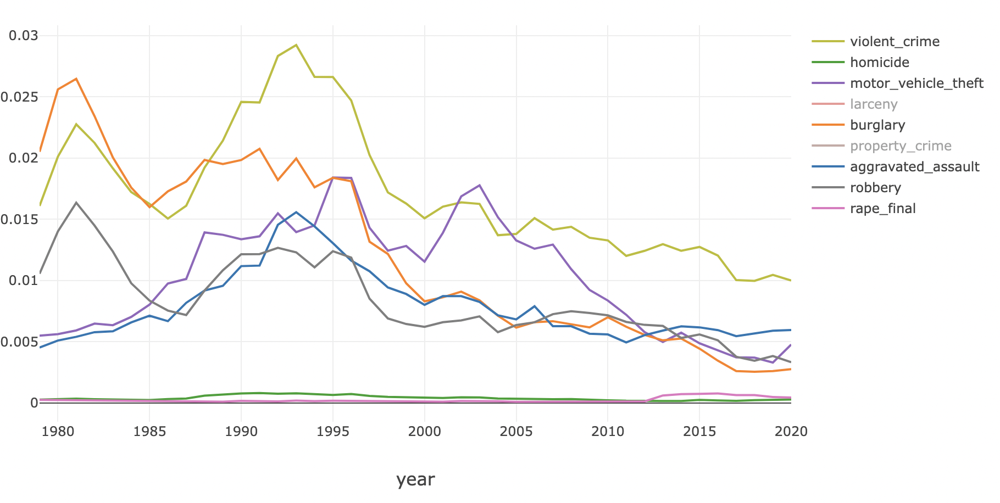
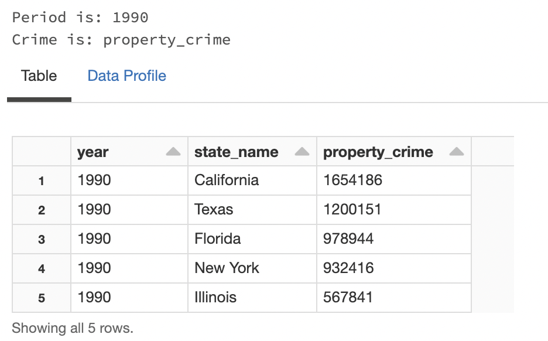
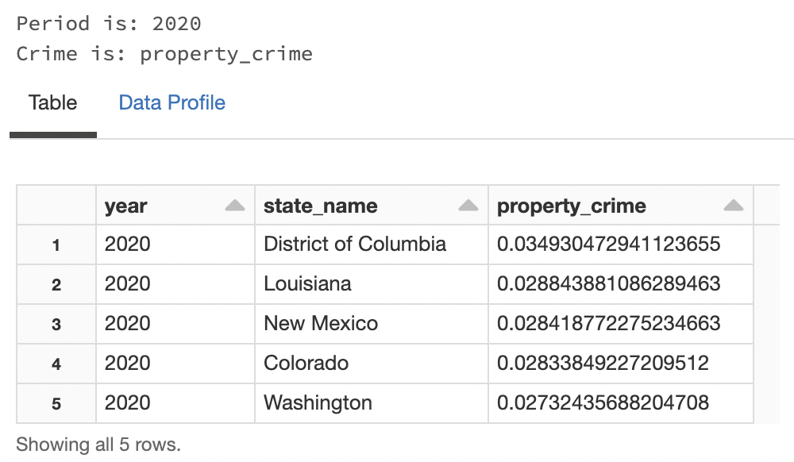
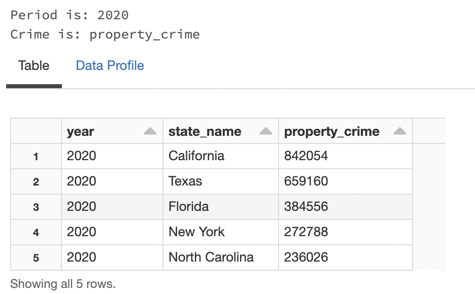

# Intent
I was interested to ground myself in a few of the data trends made available from the [FBI Crime Data
Explorer](https://crime-data-explorer.app.cloud.gov/pages/downloads). This dataset contains statistics on a
number of state-wide crimes (homicide, burglary, etc.) offering up some baseline to consider how this has
evolved with population changes. The key results largely analyze trend fluctuations after normalizing for
population changes including how various states compare. There is also a sample correlation matrix, though
this was not fully run since the implementation lacks sufficient performance characteristics and may be
improved in a future iteration.

- A few high-level learnings:
	- Overall, US per capita crimes rates are declining. The largest categories have been 'property
	  crime', followed by 'larceny' and 'burglary'. Most other crimes are reported at <1% per capita.
	  
	- By state, this is of course, different for various reasons. A few samples are shown below:
		- Washington (all crimes)
		  
		- Washington (<1% crimes, after removing 'property', 'larceny' and 'burglary')
		  
		- California (all crimes)
		  
		- California (<1% crimes, after removing 'property', 'larceny' and 'burglary')
		  
		- District of Columbia (all crimes)
		  
		- District of Columbia (<1% crimes, after removing 'property', 'larceny' and 'burglary')
		  
	- When you compare ten year blocks of time (1980,1990, 2000, 2010 and 2020) and rank states by crimes
	  per capita and compare this to raw counts, interesting patterns emerge. For example, just considering
	  'property crime':
		- In 1990, the 'District of Columbia' topped the list with ~8% property crimes per capita,
		  with Florida, Arizona, Texas and Georgia making up the remaining top 5...
		  
	  	- ...based on raw values however, California and Texas topped the list given their larger
		  square footage and population sizes...
		  
		- In 2020, property crimes per capita had reduced significantly down to ~3%, with only the
		  District of Columbia remaining in the top 5 (compared to 1990), and Louisiana, New Mexico,
		  Colorado and Washington now registering on the list...
		  
	  	- ...based on raw values, California, Texas, Florida and New York continued to be in the top 5
		  though at far lower counts than in 1990...
		  
